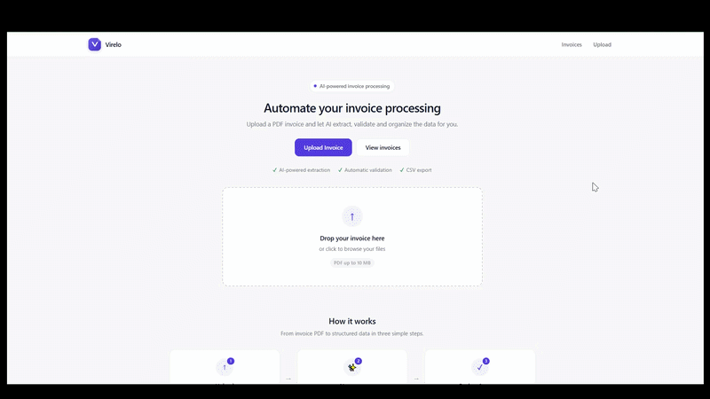

# Virelo

Локальный MVP для автоматического извлечения данных из PDF-инвойсов
с помощью локальной LLM (Ollama + Llama 3.2).

## Demo

<p align="center">
  
</p>

Upload an invoice PDF → AI extracts the fields → validate → export to CSV.

## Что умеет

- Принимает PDF-инвойс через веб-форму (drag & drop).
- Извлекает текст (pypdf — чистый Python).
- Передаёт текст в локальную Llama через Ollama.
- Получает структурированный JSON с полями инвойса.
- Валидирует данные по правилам (арифметика, обязательные поля).
- Показывает результат в виде карточек (Invoice / Financial / Line items).
- Позволяет одобрить, отклонить или отредактировать.
- Сохраняет всё в SQLite.
- Показывает список инвойсов со статистикой.
- Экспортирует один инвойс или все сразу в CSV.

**Что НЕ умеет (пока):**

- OCR сканированных PDF. Если текста в PDF нет, приложение честно
  сообщает: «This PDF appears to be a scanned document. OCR is required.»
- Импорт инвойсов из email.
- Интеграцию с бухгалтерскими системами (QuickBooks, Xero).

## Стек

| Слой | Технология |
|---|---|
| Backend | Python 3.11+, FastAPI, Uvicorn |
| Шаблоны | Jinja2 + Bootstrap 5 |
| Валидация | Pydantic 2 |
| ORM | SQLModel (SQLAlchemy) |
| БД | SQLite |
| PDF | pypdf (чистый Python) |
| AI | Ollama + Llama 3.2 (локально) |
| HTTP-клиент | httpx |

## Архитектура

```
PDF invoice
    ↓
pypdf (извлечение текста)
    ↓
Ollama (Llama 3.2) → структурированный JSON
    ↓
Pydantic (валидация схемы)
    ↓
Python-правила (арифметика, обязательные поля)
    ↓
SQLite (сохранение)
    ↓
Web UI (review + Approve/Edit/Reject)
    ↓
CSV export
```

**Ключевой принцип:** Llama только **извлекает** данные. Все финансовые
решения (какие поля обязательны, сходится ли арифметика, что показывать
пользователю) принимает Python. Это защищает от «AI решил, что всё ок».

## Требования

- Windows / macOS / Linux
- Python 3.11+ (проверено на 3.14). Используется `pypdf` — чистый Python,
  ставится на любую версию без компиляции.
- Ollama, установленная локально
- Модель `llama3.2` (~2 GB)

## Установка Ollama

### Windows / macOS

1. Скачай с https://ollama.com/download
2. Установи как обычную программу
3. Открой терминал и выполни:
   ```
   ollama pull llama3.2
   ```

### Linux

```bash
curl -fsSL https://ollama.com/install.sh | sh
ollama pull llama3.2
```

### Если Ollama падает с ошибкой CUDA

Ошибка вида:

```
CUDA error: the provided PTX was compiled with an unsupported toolchain
```

означает несовместимость драйвера NVIDIA. Запусти Ollama в режиме CPU.

**Быстро (в текущем окне терминала):**

```powershell
# Windows PowerShell
$env:OLLAMA_LLM_LIBRARY="cpu_avx2"
ollama serve
```

Оставь это окно открытым — Ollama должна работать постоянно, пока ты
пользуешься приложением.

**Постоянно (рекомендую):**

1. `Win + R` → `sysdm.cpl` → Enter.
2. Вкладка **Дополнительно** → **Переменные среды**.
3. В верхнем блоке («Переменные среды пользователя») → **Создать**.
4. Имя: `OLLAMA_LLM_LIBRARY`, Значение: `cpu_avx2`.
5. ОК → перезапусти Ollama.

После этого `ollama serve` будет всегда работать в CPU-режиме без
дополнительных команд.

## Установка проекта

```bash
# 1. Клонируй / скачай проект
cd invoice-mvp

# 2. Создай виртуальное окружение
python -m venv .venv

# 3. Активируй
# Windows PowerShell:
.venv\Scripts\Activate.ps1
# Windows CMD:
.venv\Scripts\activate.bat
# macOS / Linux:
source .venv/bin/activate

# 4. Установи зависимости
python -m pip install --upgrade pip
python -m pip install -r requirements.txt

# 5. Скопируй .env.example → .env
copy .env.example .env       # Windows
# cp .env.example .env       # macOS / Linux
```

## Запуск

**Терминал 1** — Ollama:

```powershell
$env:OLLAMA_LLM_LIBRARY="cpu_avx2"   # если есть проблемы с CUDA
ollama serve
```

**Терминал 2** — приложение:

```powershell
.venv\Scripts\Activate.ps1
python -m uvicorn app.main:app --reload
```

Открой http://localhost:8000.

## Использование

1. **Upload Invoice** — загрузи PDF с текстовым слоем
   (текст должен выделяться мышкой в любой PDF-программе).
2. Дождись результата. На CPU-режиме это 30–90 секунд для одной страницы.
3. Проверь извлечённые поля и блок **Validation**.
4. Нажми **Approve** (если всё верно), **Edit** (если нужно поправить),
   или **Reject** (если это не инвойс).
5. Скачай CSV одного инвойса кнопкой **Download CSV** или всех сразу
   через **Download all CSV** на странице `/invoices`.

## Структура кода

| Файл | Ответственность |
|---|---|
| `app/main.py` | HTTP-маршруты, точка входа |
| `app/config.py` | Чтение настроек из `.env` |
| `app/database.py` | Подключение к SQLite, init_db |
| `app/models.py` | Таблицы БД (SQLModel) |
| `app/schemas.py` | Pydantic-схема Invoice |
| `app/repository.py` | CRUD-операции с БД |
| `app/pdf.py` | Извлечение текста из PDF |
| `app/ai.py` | AIExtractor + OllamaInvoiceExtractor |
| `app/validation.py` | Правила проверки инвойса |
| `app/export.py` | Генерация CSV |
| `app/timing.py` | Замер времени этапов pipeline |

## Замена компонентов

### Другая LLM

`app/ai.py` содержит абстрактный класс `AIExtractor`. Чтобы подключить,
например, Mistral или Qwen, создай класс-наследник и подмени одну строку
внизу файла:

```python
ai_extractor: AIExtractor = YourNewExtractor(...)
```

### OCR для сканов

`app/pdf.py` содержит абстрактный `PDFExtractor`. Добавь класс
`OCRPdfExtractor(PDFExtractor)` и подмени:

```python
pdf_extractor: PDFExtractor = OCRPdfExtractor()
```

### PyMuPDF вместо pypdf (опционально)

`pypdf` — чистый Python, работает на любой версии интерпретатора.
Его хватает для типичных инвойсов.

Если позже понадобится более быстрый парсер или лучшая работа со
сложной вёрсткой — можно переключиться на `pymupdf`. Он написан на C
и требует готовой сборки под конкретную версию Python: под 3.12 и 3.11
колёса есть, под 3.13/3.14 могут отсутствовать (тогда pip начнёт
собирать пакет из исходников, что почти всегда падает на Windows).

Переключение делается без переписывания остального кода:

1. `python -m pip install pymupdf`
2. В `app/pdf.py` добавь класс `PyMuPDFExtractor(PDFExtractor)` рядом
   с `PypdfExtractor`.
3. В самом низу файла подмени одну строку:
   ```python
   pdf_extractor: PDFExtractor = PyMuPDFExtractor()
   ```

## Оптимизация производительности

На CPU-режиме большая часть времени уходит на Llama. Уже применённые
оптимизации в `app/ai.py`:

- `keep_alive: "30m"` — модель остаётся в памяти между запросами.
- `num_predict: 800` — ограничение длины ответа.
- `num_ctx: 4096` — уменьшенный контекст.
- Компактный system prompt.
- Обрезка входного текста до 8000 символов.

Замер времени каждого этапа (`[timing] pdf_extract`, `[timing] ai_extract`,
`[timing] db_save`) печатается в консоль сервера. Для более быстрой
работы можно переключиться на `llama3.2:1b`:

```env
OLLAMA_MODEL=llama3.2:1b
```

## Диагностика

| Проблема | Решение |
|---|---|
| `pip: command not found` | Используй `python -m pip` |
| `uvicorn: command not found` | Используй `python -m uvicorn` |
| Ollama: CUDA error | Запусти с `OLLAMA_LLM_LIBRARY=cpu_avx2` |
| AI extraction failed / HTTP 500 | Ollama не запущена или крешится. Проверь `Invoke-RestMethod http://localhost:11434/api/tags` |
| «This PDF appears to be a scanned document» | PDF без текстового слоя. OCR пока не поддерживается. |
| Долгий ответ (2+ минуты) | CPU-режим. Попробуй меньшую модель: `ollama pull llama3.2:1b`, затем в `.env` → `OLLAMA_MODEL=llama3.2:1b` |
| База «застряла» на старых данных | Удали `invoices.db`, перезапусти uvicorn. |
| Favicon не обновляется | Жёсткое обновление браузера (Ctrl + F5). |

## Что дальше

Идеи для развития MVP:

- OCR для сканов (Tesseract / EasyOCR).
- Извлечение из email (IMAP → PDF-вложения).
- Редактирование line items в UI.
- Excel-экспорт (openpyxl).
- Мультивалютные правила валидации.
- Интеграция с QuickBooks / Xero.

## Лицензия

MIT